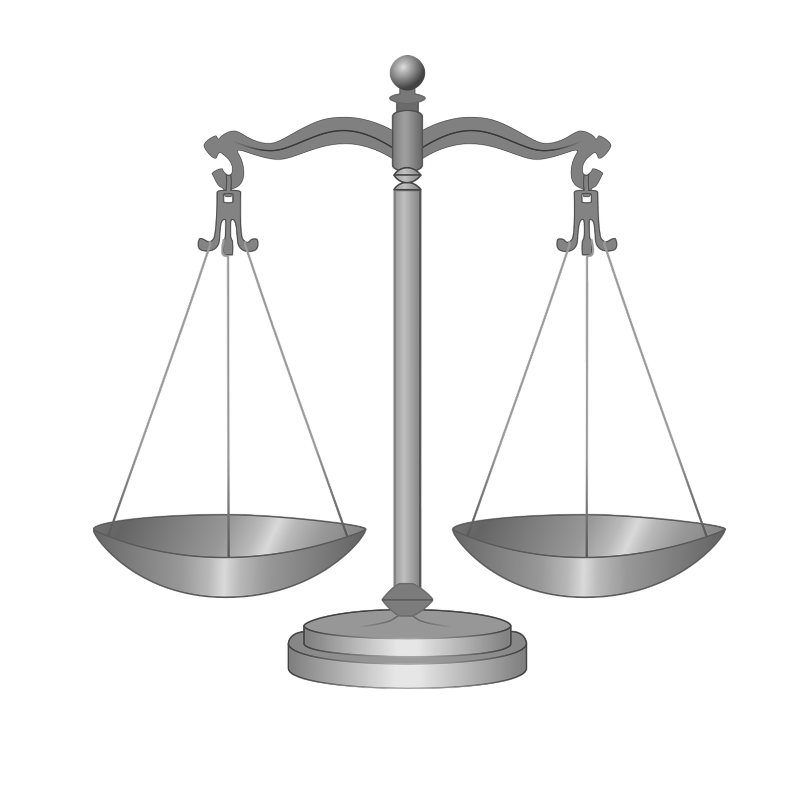
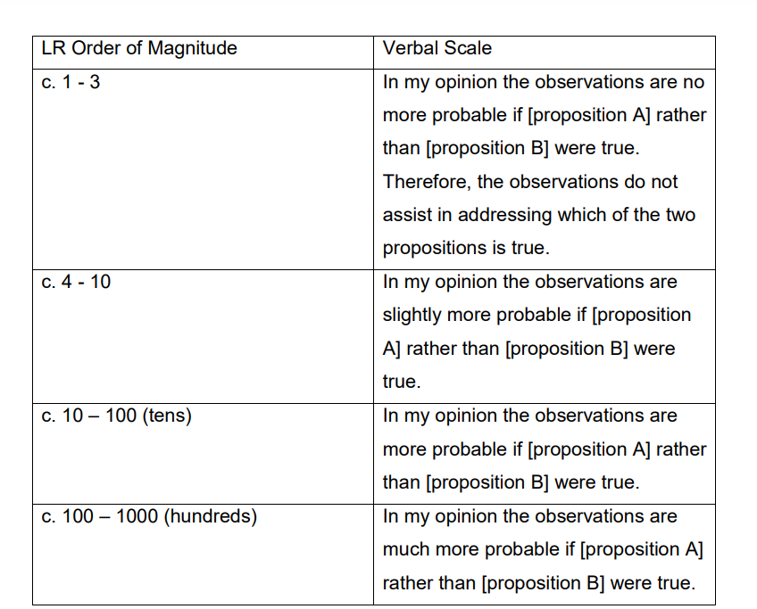
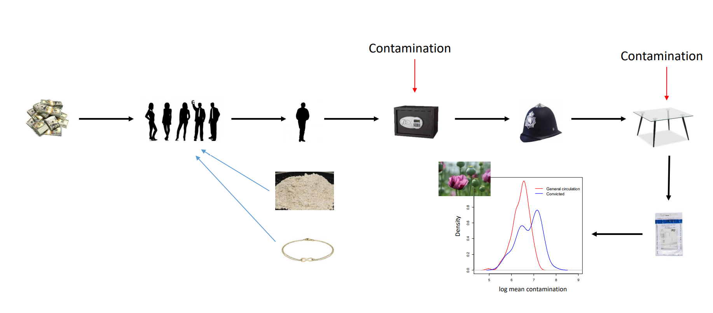
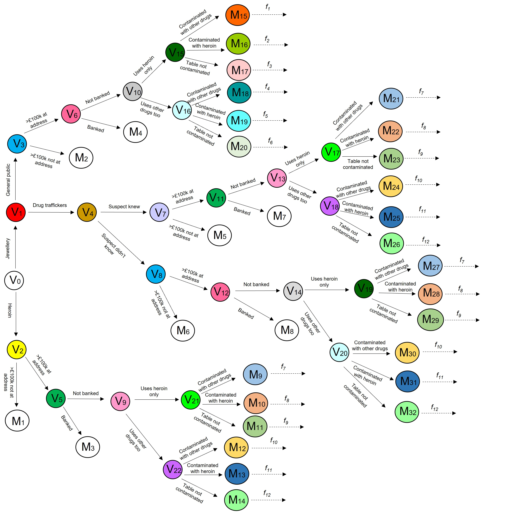
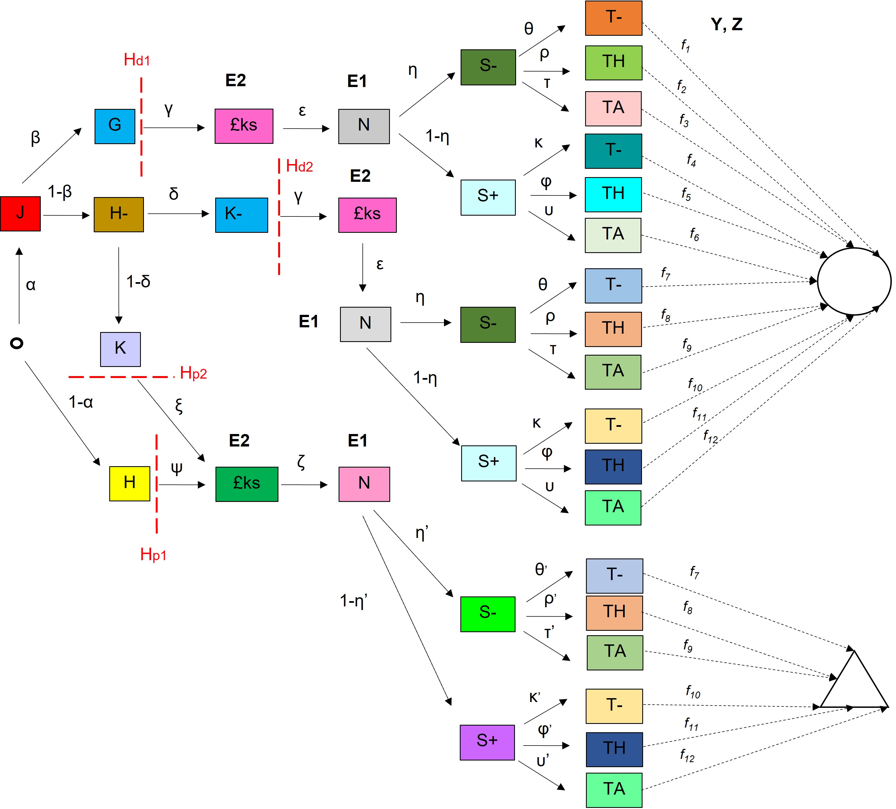

```{r packages, echo=FALSE, message=FALSE, warning=FALSE}
library(tidyverse)
```

class: top

#Motivation

- Criminal cases can be complicated. Many pieces of evidence, some quantitative, some not. 

- Probabilistic reasoning is not straightforward, even for statisticians.

- High profile example: the Lucy Letby case. Trial lasted a year. Multiple babies involved (some multiple births), medical evidence from multiple experts, data on whether present or not, discussion of motive (digital evidence, notes), ... experts still arguing several years later. How to make sense of it all?

- Miscarriages of justice have happened due to failures in probabilistic reasoning, e.g. Sally Clark.

---

class: top

# Introduction

.pull-left[

- Framework for single items of forensic evidence

- Graphical modelling for more complicated combinations of evidence. Two examples: drugs on banknotes and the case of Meredith Kercher. 

- Moving from theory to practice.

- Medical misconduct cases.

]

.pull-right[


.center[
```{r, echo=FALSE, out.width="60%", fig.cap=""}



```
]
]

---

class:middle

#Single items of forensic evidence

---
class: top
# Likelihood ratios

- Many types of forensic evidence are associated with measurements and data - DNA, trace evidence, biometric evidence.

- Criminal cases tend to feature two competing arguments.

- For evidence $E$, prosecution proposition $H_p$ and defence proposition $H_d$, likelihood ratio is:

$$\frac{P(E \mid H_p)}{P(E \mid H_d)}$$

- Reasoning from the odds form of Bayes theorem.

$$\frac{P(H_p \mid E)}{P(H_d \mid E)}= \frac{P(E \mid H_p)}{P(E \mid H_d)} \times \frac{P(H_p)}{P(H_d)}$$


---
class:top

#Likelihood Ratios for statistical evidence

- Framework is reasonably well accepted in forensic science.

- Methodology features in Forensic Science Regulator Code of Conduct: 
https://assets.publishing.service.gov.uk/media/602407728fa8f5146f0769d9/FSR-C-118_Interpretation_Appendix_Issue_1__002_.pdf

- Lots of research has been done on developing different statistical models for different evidence types although outside of DNA the framework is used more qualitatively in practice, i.e. the need to consider the likelihood of the evidence under at least two competing propositions.

- Motivated by Sally Clark. Avoids Prosecutor's Fallacy. Note the code of conduct doesn't cover forensic pathology.

---
class:top
# Verbal Scale


.center[
```{r, echo=FALSE, out.width="50%", fig.cap=""}



```
]

---

class: top
# Multiple pieces of evidence

- But what about when we have multiple pieces of interrelated
evidence? How should the likelihood ratio be computed?

- Bayesian Networks first used for the modelling of legal evidence in 1989 in paper by Aitken and Gammerman. 

.center[
```{r, echo=FALSE, out.width="45%", fig.cap=""}

magick::image_read_pdf("img/BNexample.pdf",
                       pages = 1)

```
]
---

class:middle

# Graphical modelling

---

class: top

# Probabilistic reasoning in legal cases

- Work with Jim Smith, Gail Robertson, Philip Dawid, Jay Kadane,
Julia Mortera, Francesco Dotto. Funded by Turing Institute.

- Can graphical methods be used to aid decision-making in legal cases? For example, to assist in investigation, to assist lawyers in putting together arguments for a case and to assist the judge and jury in coming to conclusions?

- Or at least to help ensure that the evidential weight of dependent pieces of statistical evidence is computed in a probabilistically correct framework. 

- Will focus on use of Chain Event Graphs. 
---

class:top

# Chain Event Graphs

- More concise expression of an event tree

- Start with an event tree, with nodes representing states or events and directed edges represented transitions between these events.

- Each edge is associated with a conditional probability - the probability of transitioning between the two nodes given what has come before in the graph.

- Each path through the tree describes a possible unfolding story in the case. Represent competing hypotheses for how the evidence arose in the case. 

- Colours are used to identify groups of edges with the same probabilities.
---

class:top

# Event tree

- Assailant stabs victim using an identified knife $S_{1}$ or some other knife 
$S_{2}$ before discarding $D_{i}$ or cleaning $C_{i}$ it and putting it in the cutlery drawer.
- Precise knife used in the attack is agreed to be independent of where it was
subsequently placed - nodes coloured red. 

.center[
```{r, echo=FALSE, out.width="45%", fig.cap=""}

magick::image_read_pdf("img/knife_example1.pdf",
                       pages = 1)

```
]


---

class:top

# Event tree to Chain Event Graph

- To convert to a chain event graph, amalgamate sub trees that are isomorphic (same topology and colour)

- And draw into a sink node

- Each path through the graph describes a possible unfolding in the case

.center[
```{r, echo=FALSE, out.width="70%", fig.cap=""}

magick::image_read_pdf("img/knife_example_2.pdf",
                       pages = 1)

```
]

---
class: top

# Bayesian networks (BNs) vs Chain Event Graphs (CEGs)

- Unlike BNs, CEGs describe time-ordered paths. Easy to see chains of events through time.

- CEGs can represent asymmetric situations easily - just end the path! In a BN would need to continue enumerating situations that we know did not occur. 

- CEGs generally less compact than BNs and fewer software packages available to help construct them.

- Advantage of CEG over event tree is that conditional dependence relationships are expressed. 

- For all graphical methods, need to assign probabilities to edges. Subjective. 

---

class: top

# Chain event graphs for legal reasoning

Two adaptations to standard CEGs needed for legal reasoning:

- Trials tend to have two competing sides - prosecution and defence. Thus we use two sink nodes so each path through the network is associated with one side.

- In legal cases, graphs contain evidence. We already know what the outcome of this evidence is. Thus don't need to include edges to model all possibilities (e.g. the DNA measurements were X so no need to model the case where their value is Y). Evidence edges are represented as single edges, but we keep the probability of the edge to be the prior probability (i.e. before observing the evidence). This means that we can calculate likelihood ratios and other statistics of interest but the graph is much smaller.

---

class: top

# Drugs on banknotes

.center[
```{r, echo=FALSE, out.width="70%", fig.cap=""}


```
]

---

class: top

# Example: drugs on banknotes

- Previous work, evaluating likelihood ratios for evidence consisting of traces of drugs on banknotes. Used as evidence in drug dealing convictions. 

- Problem: there may be legitimate reasons why banknotes have traces of drug on them. Drug use, notes contaminated before coming into suspect's possession, background contamination. What does "associated with drug dealing" mean for banknotes?!

- We need to say something about how the banknotes came to be contaminated for the evidence to be meaningful (activity-level propositions).

- Looked at slightly altered example of real case.

---

class:top

# Storylines

.center[
```{r, echo=FALSE, out.width="100%", fig.cap=""}



```
]

---

class:top

# Evidence and propositions

Evidence
- £100k found at property in safe
- This was not in a bank
- Measurements taken of heroin on banknotes
- Measurements taken of contamination on tamper evident bags

Propositions
- $H_{p_1}$: The suspect obtained the banknotes by dealing drugs 
- $H_{p_2}$: The suspect knowingly used a jewellery business to launder money obtained by the drug trafficking activities of others.
- $H_{d_1}$: The suspect had a legitimate jewellery business selling jewellery to the general public
- $H_{d_2}$: The suspect used a jewellery business to launder money obtained by the drug trafficking activities of others but was not aware of this
    
---

class:top

# Staged tree

.center[
```{r, echo=FALSE, out.width="45%", fig.cap=""}



```
]

---

class:top

#Chain Event Graph

.center[
```{r, echo=FALSE, out.width="55%", fig.cap=""}



```
]

---

class:top

# Using the Graph

- For judges/ jury. Easy to compute probabilities of paths or groups of paths, just multiply the edges together. E.g., prosecution storylines:

$$
\begin{split}
P(\triangle)  = & ((1 - \alpha) \ \psi\ + \alpha\ (1 - \beta)\ (1 - \delta)\ \psi) \ \zeta\ (\eta\ (\theta'\ f_7(\mathbf{Y}, \mathbf{Z} \mid s) + \\
&\rho'\ f_8(\mathbf{Y}, \mathbf{Z} \mid s) + \tau'\ f_9(\mathbf{Y}, \mathbf{Z} \mid s)) + (1 - \eta)\ (\kappa'\ f_{10}(\mathbf{Y}, \mathbf{Z} \mid s) \\
&+ \upsilon'\ f_{11}(\mathbf{Y}, \mathbf{Z} \mid s) + \phi'\ f_{12}(\mathbf{Y}, \mathbf{Z} \mid s)))
\end{split}
$$

- For forensic scientists. Also possible to compute LRs for the evidence by conditioning on the edges associated with the propositions. 

- For lawyers. Can do sensitivity analysis, investigate which arguments are plausible.

- For police. Where is more evidence needed? Is there enough evidence to prosecute?

---

class: middle

#The case of Meredith Kercher

---


class: top

# Example: the case of Meredith Kercher

- High profile Italian case. Murder of British Erasmus student, Meredith Kercher, 2007.

- Amanda Knox (her flatmate) and Raeffele Sollecito (Knox's boyfriend) accused of the murder. 

- First trial 2009, found guilty. Acquitted in 2011. 2013 found guilty again. 2015 acquitted again. 

- Another individual, Rudy Guede was sentenced in 2008 to 30 years imprisonment. 

- Two key items of forensic evidence: Sollecito's DNA found on Kercher's bra clasp in her bedroom 46 days after murder and Knox's DNA found on handle of kitchen knife purported to be used for the murder (with low copy DNA on blade declared to be from Kercher).

- Only considered knife evidence from first trial (and excluded DNA).


---

class: top

# The knife evidence

- Knife found in a cutlery drawer in Sollecito's apartment.

- Sollecito's knife - 17.5 cm blade length, 3 cm wide, 1.5 mm thick.

- Wounds: fatal wound on left of neck- 8 cm deep, 8 cm long and 0.4 cm wide. Smaller wound on right of neck - 4 cm deep, 1.5 cm long and 0.4 cm wide. Bruising around wounds. 

- Could the knives have made wounds of that size? Bruising suggests fully inserted but wound not deep enough, no exit wound.

- Debates over whether blood on knife. Knife left bloody stain on mattress. If knife was washed, could that have removed blood and left DNA?

- Inspector lied to Knox and told her blood had been found on knife. She had a worried conversation with her mother on the phone and this was used as evidence.


---

class: top

# CEG for the minor wound

.center[
```{r, echo=FALSE, out.width="80%", fig.cap=""}

magick::image_read_pdf("img/CEG_minor.pdf",
                       pages = 1)

```
]


---

class:top

#Full CEG!

.center[
```{r, echo=FALSE, out.width="90%", fig.cap=""}

magick::image_read_pdf("img/Knox_final.pdf",
                       pages = 1)

```
]


---

class: top

# Comparison between CEG, BN and Wigmore

- For this case we also drew a BN and a Wigmore Chart.

-  Wigmore Charts display legal arguments and are not usually probabilistic.

- CEG easily displayed the time-ordered elements.

- But was much much larger (and I didn't show the staged tree...)

- CEGs and BNs require the probabilistic dependencies to be specified, and probabilities to be assigned to edges. Wigmore Charts do not. 

- But then, BNs and CEGs can be used to compute probabilistic quantities.

---

class:top

# Summary

- CEGs document a mental model of how different aspects of a case relate to each other. 

- Use them to work through and understand different possible arguments and how the available evidence supports the various propositions.

- Mental model is that of the person who drew the network. 

- They can be unwieldy, but so can manually assessing the evidence. 

- They ensure that the evidence is considered in a logically consistent manner - avoiding potential errors and common fallacies.

- Potential for object oriented CEGs, and NLP methods for extracting information to automate building of CEGs.

---


class: middle

# From theory to practice

---
class: top

# RSS Statistics and the Law - training and policy

- https://rss.org.uk/membership/rss-groups-and-committees/sections/statistics-law/

- Section set up in 2015, aiming to improve the use of statistical evidence and statistical reasoning in the law, to provide a forum for those interested in research at the interface of statistics, law and forensic science and to influence policy in these areas.

- Have produced or collaborated on various training documents for lawyers - ICCA guide, primers, Nuffield guides.

- Responded to calls for evidence on forensic science guidelines, algorithms in the justice system, research in forensic science...

- Work influenced inclusion of LR framework in FSR code of conduct. 

---

class: top

# Much more to be done

- Challenging to communicate between two very different professions - statistics and law.

- Easy to make errors in interpretation when you're dealing with subtle statistical points.

- Can sometimes be difficult to convince the legal profession of the importance of statistics. Seen as common sense. Sally Clark case helped. 

- Not always obvious when statistics present. No p-value, doesn't mean there's no statistics - data collection, presentation and interpretation can be hidden.

- How to teach lawyers when to call a statistician perhaps more attainable goal than teaching them statistics.

- Adversarial system sometimes works against us - the goal of the lawyer is not to be correct but to win the case.

---
class: top

# Ongoing plans

- CPD training for advocates and crime scene investigators. 

- Improving access to statistical expert witnesses. Not enough highly trained statisticians and the lawyers don't know where to find them. Planning a mentor scheme and to publish example expert witness reports.

- Further training documentation. How to interrogate an expert witness report. How to spot statistical evidence. 

- Further reform to policy to incorporate broader statistical points when there are clusters of events and interrelated pieces of evidence.

---
class: top

# Healthcare Serial Killer or Coincidence?

- Latest RSS S&tL report: ‘Healthcare serial killer or coincidence? Statistical issues in investigation of suspected medical misconduct’.

https://tinyurl.com/ww64s34y

- Authors: Peter Green, Julia Mortera, Neil McKenzie, Richard Gill, William Thompson. Statisticians, lawyers, psychologists, expert witnesses.

- Published September 2022. 

- A discussion of the various statistical issues facing those investigating medical misconduct cases with case studies and a set of recommendations.

---
class: top

# Clusters of events

- Common starting point - a perceived increase in deaths or adverse events in a medical setting. Has there been a crime?

- Given many possible covariates it's not obvious when a spike is really a spike. Was there a change in the underlying population (lower birthweight babies, more births)? Was it just random?

- Statistical input is needed. In the Letby case the prosecution did not get statistical advice but still made probabilistic arguments:

"The statistics of the mortality rate were comparable, prior to January 2015, but there was "a significant rise" in the number of babies dying or having "catastrophic collapses"

- Prosecutor's Fallacy - small probability of seeing n deaths given no foul play does not imply foul play. Alternative explanations (as per FSR guidance) need to be considered.

---
class: top

# Perceived patterns

- A set of adverse events is picked and a single healthcare professional is found to be present for all of them.
  - How was an adverse event defined? Cognitive bias often a problem. 
  - What counts as presence?
  - Are the adverse events independent? Some same baby or multiples. 
  - Was blinding/ redaction applied as necessary?
  - How often was the healthcare professional at work and at what times?
- Again, probabilistic arguments being made without a statistician:
“As with all these cases – it is the coincidence of problems happening when Lucy Letby was about and the coincidence of the same problems happening with different babies at different times, which we suggest is so telling and indicates that it was her malign hand at work.”
- Correlation of Letby being on duty for the events picked out by the medical expert was taken as evidence of Letby’s guilt. But “correlation is not causation”. And we cannot distinguish between malice and incompetence.

---
class: top

# No statistics?

- 'It is absolutely astounding that statisticians are pursuing this narrative,' Dr Evans said (main medical expert witness). 'The way the police investigated the case, the way the prosecution conducted the case and the way all of us gave evidence on behalf of the prosecution in the trial had nothing to do with statistics.’

- It's not always obvious to non-statisticians when statistics is being done. Study design, collection, interpretation and presentation are all statistics. 

- The system is such that the police/ lawyers are the ones deciding where statistical input is needed. 

- Deficiencies in statistical thinking at a whole case level. Can graphical modelling approaches help?
---

class: top

# Conclusions

- Methods for interpreting the evidential value of single items of forensic evidence under straightforward hypotheses are fairly well-established.

- Graphical approaches help in more complex situations, where there are multiple pieces of correlated evidence or where hypotheses are at the activity-level. 

- Useful for many different aspects of the legal process - investigation, forensic evidence evaluation, assessing which arguments are compelling and making probabilistic statements about the case or pieces of evidence.

- Require coordination between statisticians, forensic scientists and lawyers to set out arguments being made and how the evidence fits in and to assign probabilities.

- Progress has been made but there is still much work to be done in bridging the gap between statisticians and lawyers to ensure proper interpretation of statistical evidence and correct statistical reasoning in the courtroom. 

---

class: top

# References

- Likelihood ratios for drugs on banknotes: <br>
The evaluation of evidence for auto‐correlated data in relation to traces of cocaine on banknotes, A.L. Wilson, C.G.G. Aitken, R. Sleeman, J. Carter, Journal of the Royal Statistical Society: Series C (Applied Statistics), 2015, 64(2), 275-298

- Chain Event Graphs work on banknotes: <br>
Chain event graphs for assessing activity-level propositions in forensic science in relation to drug traces on banknotes, G. Robertson, A.L. Wilson, J.Q. Smith, Law, Probability and Risk, 2024, https://doi.org/10.1093/lpr/mgae013

- Chain Event Graphs for Kercher case: <br>
A comparison of graphical methods in the case of the murder of Meredith Kercher, A.P. Dawid, F. Dotto, M. Graves, J.B. Kadane, J. Mortera, G. Robertson, J.Q. Smith, A.L. Wilson, under review. https://arxiv.org/pdf/2403.16628


---
